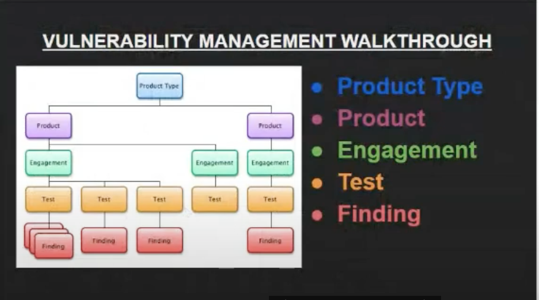
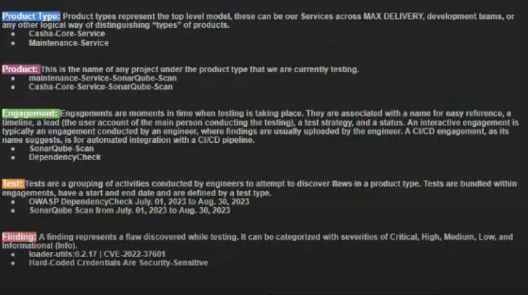

# This is abut DefectDojo

## Explaining the above picture:

Things to note: **Engagement** + **Product type** = **Product**
**Product type** is our **Product**, inside the **Product** we have many **Product type**(many Scans)

Test is the activities. What day to what day did it happen. It basically runs based on what we give it and the pipeline we want it to run on, then give us the result