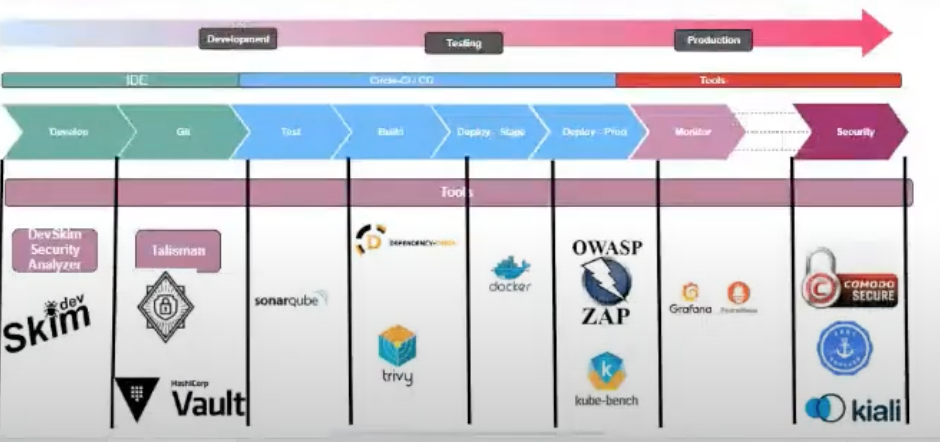

# WorkFlow of DevOps

1. **Development Environment** - where the development takes place
- Here we can use IDE - Integrated Development Environment
    * Here we have the Develop & Git
    - **Develop**
        * Dev Skim(Security Analyzer)- Checks for caches. This is under developmental level
    - **Git**
        * Talisman - Checks for code misconfiguration on code level
        * Hashicorp Vault - used to manage our secrets(credentials(API tools), token, values for database for application); help us to rotate our values that it becomes hard to get the value but it calls the exact value as at when we need it

2. **Testing** - do all manner of testing here
- Here we use CircleCi/CD -  Continuous Integration & Deployment
    * We have test(statical Analytical testing), Build, Deploy-Stage & Prod and you monitor and enforce security at run time
    - **Test**- used for `statical Analysis`(:for performing software application security testing, check for vulnerabilities, check for technical dirt, and bugs)
        * Sonarcube- verify the percentage of coverage that the unit test has covered
    - **Build** 
        * Dependency Check - a solution that helps us check for dependency issue n our packages that our application uses(they'd alert us so we'd do the appropriate thing by upgrading)
        * Trivy - a security tool that we use to do testing such as test for Pre-build base image scan(Check for vulnerabilities on the base image(Ubuntu, node, etc); it's the minimum requirement for a dockerfile to be built and turn into an image for it to run as a container) and Post-build image scan
    - **Deploy-Prod**
        * OWASP ZAP(Open Web Application Security Project) - A security tool that can run `against`(:coz it does `automated penetration testing`(:When you use automated tools to simulate the attackers skills and methodologies and try to attack the system automatically; it does certain type of `exploits`(: when you hack or try to gain access and exploit system)) & `automated API scanning`(Checks endpoint, scans the `OWASP Top Ten`(: a security threats in web app environment; Top ten - Broken authentication: able to gain access to a system without proper authorization/authentication), Input invalidation, `SQL Injection`(:try to query the backend(DB) to give out info that the owner of the system did not authorize))) the staging environment and against Production

        * Kube-bench - check against security based standard. Whn you runs this against environment, it gives us vulnerabilities and we use it to improve our system.
    
3. **Production**
- Here we can use Tools
    * **Monitor**
        - Grafana
    * **Security**
        - Comodo Secure - digit cent like ca
        - sec manager - used to manage stuffs like kubernetes 
        - kiali - `TLS`(:Transport layer Security - ensures that we are communicating on a secure protocol that is encrypted. So we're able to authenticate the server as to who the person says he is. It is a one-way verification. It uses certain measures to verify that this connection is secure and encrypted that the server is using), `MPLS` (: Mutual Transport Layer Security on the Pod level, we want to make sure that information/Communication is encrypted from one end to another. If an attacker should get access to our kubernetes cluster, they won't be able to sniff/ read our traffic/packets/data (As they carry several data like Credit Card Personal Identification Information), to ensure that it's not happening, we employ MPLS)

# DevSecOps Workflow

## Explanation of the Picture
1. A `user` trying to make a `commit` to `GitHub`, our environment is `CircleCi`, our environment variable, secret, values is stored on `HashiCorp Vault`.

2. For the build, one condition out of the two would work; `fail` or `pass`. If the node build is succesful, it goes to the next which is node.js Testing(like QA testing), if it fails it'd send us a slack notification. If it should pass, it would go to the next stage which is dependency check(which would check for dependency like libraries and artifacts that our appilication depends on to function), if there is a vulnerability, it sends it down to `DefectDojo Vulnerability Database`(have it coz we have a lot of tools that's gonna be giving us a lot of security findings. With a VMS(Vulnerability management system), we are able to have a track every findings on every tool and we're able to centarlize it after every database).

So successful, next stage, fail:slack. NExt stage: Sonarqube: checks for several thing on the code level. Static Appilication Security testing(It checks for how the code is being structured, checks for vulnerability, security hotspot, checks for code coverage) means it is not running. 

If it pass, we go to docker compliance check(We have an OPA  that would check how our dockerfile was written) oPA won't give us report coz there's no reporting mechansim for now

Base image scan happens before the build: prebuild base image scan; if it was suceesful and there's no vulnerability, it'd go to the next image. After the build(which is a container that once you deploy, the app is running), the Trivy would use that built image stored in GCR(Google Container Registry) and runs a scan; so you now have an img- PostImage (which is the combined application/other artifact(Combination of dependencies, source code)  that got built as a result of the built and teh base image)

Next stage: Base Image Scan(Scans the base image like Node.js, Ubuntu: ar elike OS that have the minimum requiremnets for you app to work) if it fails, it'd not Pass: 1st fqail:issues with configuration or did not pass our minimum requirement but we still get the findings of VMS.

The PostG would now scan the img. The difference in result is that the prebuild gives us security issues of the base image nd the result of postbuild is that it gives us security issues of base image, dependencies and also security issues on the code.

then we can now push to GCR, then insteead of CIS we use kubebench which is to check for bench mark. Thisis where we use our OPA nad now we are ready to deploy to kubernetes cluster. After then, we'd still need something like Security that still checks the code.

Then once we are happy, a pull request is raised. Grafana for health check

ZEro Trust- concept to look at trust as a vulnerabilty. So coz we don't trust communication from one pod to another we now encrypt communication so that people

